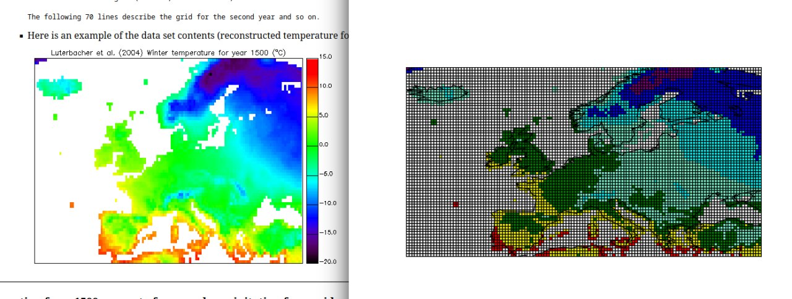

# parse_CRU_data
A script for extracting meteorological data from the CRU_data dataset and save to csv

### Usage:
```
pip install -r requirements.txt

python parse_CRU_data.py -suf temp_luterbacher_su.txt -spf temp_xoplaki_sp.txt -r 70 -c 130 -urlo 39.75 -urla 69.75 -lllo -24.75 -llla 35.25 -y_sta 1500 -y_sto 1500 -map
```

### Image:
